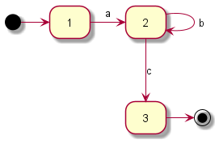

# Regex Intro

> Some people, when confronted with a problem, think "I know, I'll use regular expressions." Now they have two problems.

> The plural of regex is regrets

* řetězce popisující množinu řetězců
* hlavní použití
  * validace textu
  * vyhledávání v textu
  * nahrazování v textu
* více standardů, můžou se lehce lišit v syntaxi, způsobu používání metaznaků
* teorie na pozadí pro zájemce
  * Chomského hiearchie gramatik
  * Regulární gramatiky
  * Regulární jazyk
  * Deterministické konečné automaty

### Regulární výraz

ab*c

### Regulární gramatika

* S -> aB
* B -> bB
* B -> c

### Deterministický konečný automat

---

### Koncepty

https://regex101.com/

* přesná shoda
* flagy
    * g, i, m
* třídy znaků, rozsahy
    * []
    * negace [^]
* tečka
* bílé znaky, speciální znaky, hranice
    * \n, \t  
    * \w, \d, \s
    * \b
    * ^, $
* alternace
    * |
* opakování
    * +, *, ?
    * {min, max}
* lazy opakování
    * ?
* skupiny
    * ()
    * (?<name>)
* loookaround
    * ahead (?=), (?!)
    * behind (?<=), (?<!)

### Příklady

* emailova adresa
* IP adresa
  `(25[0-5]|2[0-4][0-9]|[01]?[0-9][0-9]?)\.(25[0-5]|2[0-4][0-9]|[01]?[0-9][0-9]?)\.(25[0-5]|2[0-4][0-9]|[01]?[0-9][0-9]?)\.(25[0-5]|2[0-4][0-9]|[01]?[0-9][0-9]?)`
* promenne v topicu / url v mocqaccinu

### Zdroje

* https://www.regular-expressions.info/quickstart.html
* https://developer.mozilla.org/en-US/docs/Web/JavaScript/Guide/Regular_Expressions
* https://docs.oracle.com/javase/7/docs/api/java/util/regex/Pattern.html
